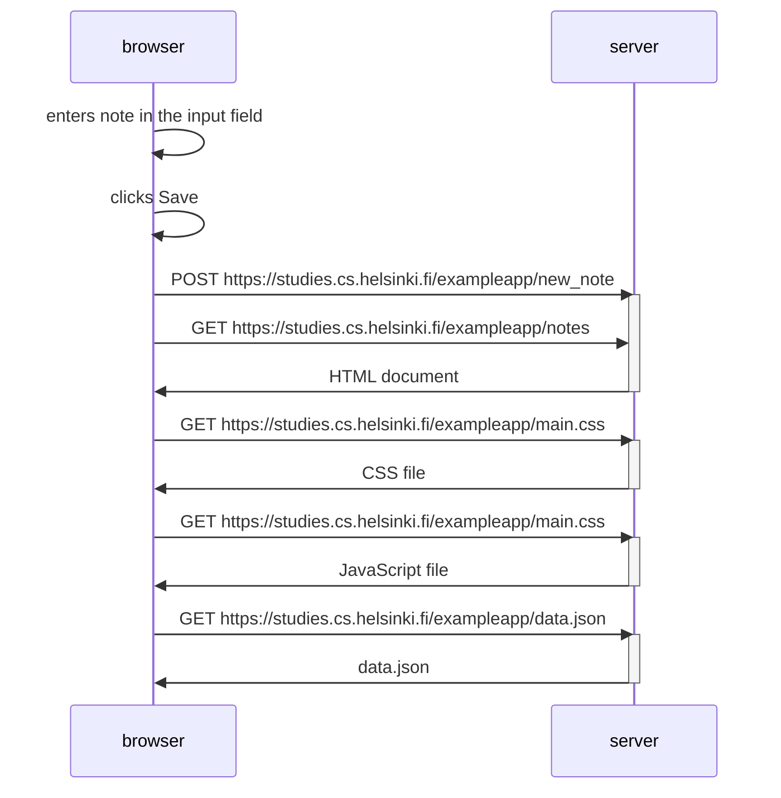

```mermaid
sequenceDiagram
    participant browser
    participant server
    browser->> browser:enters note in the input field
    browser->> browser:clicks Save
    browser->>server: POST https://studies.cs.helsinki.fi/exampleapp/new_note
    activate server
    browser->>server: GET https://studies.cs.helsinki.fi/exampleapp/notes
    server->>browser: HTML document
    deactivate server
    browser->>server: GET https://studies.cs.helsinki.fi/exampleapp/main.css
    activate server
    server->>browser: CSS file
    deactivate server
    browser->>server: GET https://studies.cs.helsinki.fi/exampleapp/main.css
    activate server
    server->>browser: JavaScript file
    deactivate server
    browser->>server: GET https://studies.cs.helsinki.fi/exampleapp/data.json
    activate server
    server->>browser: data.json
    deactivate server


```
